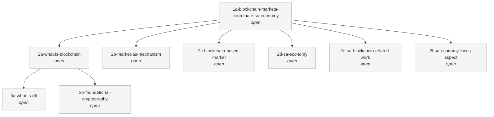

# Research tree

Generated by `workflow/render_research_tree.py` — do not edit.

```mermaid
graph TD
  n0["1a-blockchain-markets-coordinate-sa-economy<br/><i>open</i>"]:::open
  n1["2a-what-is-blockchain<br/><i>open</i>"]:::open
  n2["3a-what-is-dlt<br/><i>open</i>"]:::open
  n3["3b-foundational-cryptography<br/><i>open</i>"]:::open
  n4["2b-market-as-mechanism<br/><i>open</i>"]:::open
  n5["2c-blockchain-based-market<br/><i>open</i>"]:::open
  n6["2d-sa-economy<br/><i>open</i>"]:::open
  n7["2e-sa-blockchain-related-work<br/><i>open</i>"]:::open
  n8["2f-sa-economy-focus-aspect<br/><i>open</i>"]:::open
  n0 --> n1
  n1 --> n2
  n1 --> n3
  n0 --> n4
  n0 --> n5
  n0 --> n6
  n0 --> n7
  n0 --> n8
  classDef open fill:#f5f5f5,stroke:#999,color:#333
  classDef supported fill:#2e7d32,stroke:#1b5e20,color:#fff
  classDef refuted fill:#c62828,stroke:#8e0000,color:#fff
  classDef inconclusive fill:#f9a825,stroke:#c17900,color:#000
  classDef abandoned fill:#eeeeee,stroke:#999,color:#666,stroke-dasharray:3 3
  classDef deferred fill:#1565c0,stroke:#0d47a1,color:#fff
  classDef bypassed fill:#ffffff,stroke:#666,color:#333,stroke-dasharray:5 5
  classDef converged fill:#00838f,stroke:#005662,color:#fff
  classDef contested fill:#6a1b9a,stroke:#38006b,color:#fff
```
